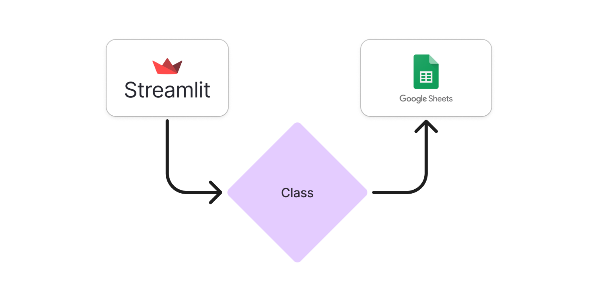
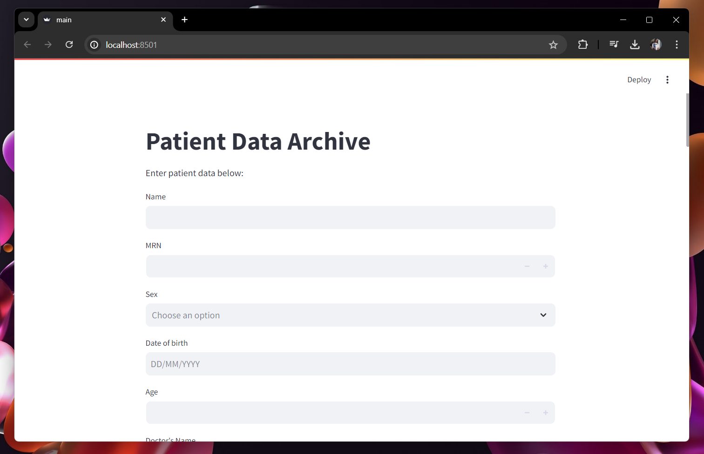

# Archiving Web Application using Python and Google Sheets

## Introduction
This is a web application program used for archiving patient's data using Python for the frontend and backend. For the frontend, [Streamlit](https://streamlit.io/) was used to make a simple user interface without the hassle of creating any HTML code. The main idea of this application is to by creating a class named Patient in ``Patients.py``, that class will be the middleman between the frontend and the backend. 

The frontend will act as the *data collector* from the user input and and the class will be filled with the patient's data. The main functions and uses of the Streamlit library can be seen in the ``frontend.py`` file. The backend which is connected through a Google Sheets file using the basic [Google Sheets API](https://developers.google.com/sheets/api/guides/concepts) using [Google Cloud](https://cloud.google.com/) and also using a high-level API library, [gspread](https://github.com/burnash/gspread). The backend will act as the *data appender* and will append all the patient's data into a row inside the spreadsheet connected inside the ``backend.py`` code. The image below clears the main process of this application.


## Example
Below is how the web application should look like:


## Usage
To use this repo and edit it to your own liking, you can do the following:
```
git clone https://github.com/muthanii/archiving-web-app.git
.\venv\Scripts\activate
pip install -r .\requirements.txt
```

## Useful links
- [Fantastic video for importing and using the APIs](https://www.youtube.com/watch?v=zCEJurLGFRk&t=355s)
- [Streamlit API reference](https://docs.streamlit.io/)
- [gspread API reference](https://docs.gspread.org/en/v6.0.0/)
